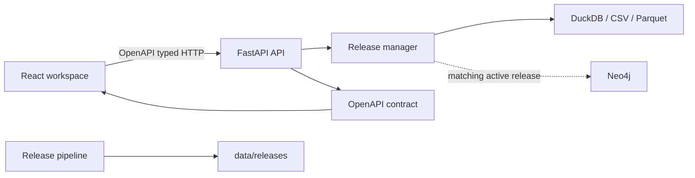

# PestKG architecture

PestKG is a release-aware, read-only research portal. React renders the
bilingual workspace, FastAPI exposes `/api/v1`, DuckDB reads the selected
immutable release, and Neo4j is an optional acceleration path for graph reads.

## Invariants

- Each request resolves one immutable release and reports it through
  `X-PestKG-Release`.
- Neo4j is used only when its loaded release matches the active request.
- Source entities remain jurisdiction-local; cross-country traversal uses
  published semantic-alignment relationships.
- API schemas are generated by FastAPI and consumed by the web application.

See [file governance](FILE_GOVERNANCE.md), the
[API contract](../api/API_CONTRACT_V1.1.md), and the
[deployment runbook](../operations/DEPLOYMENT.md).
